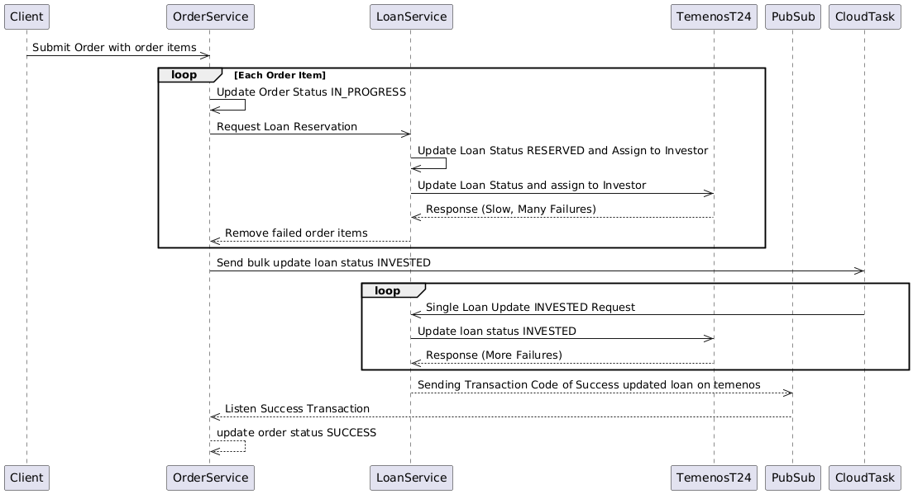
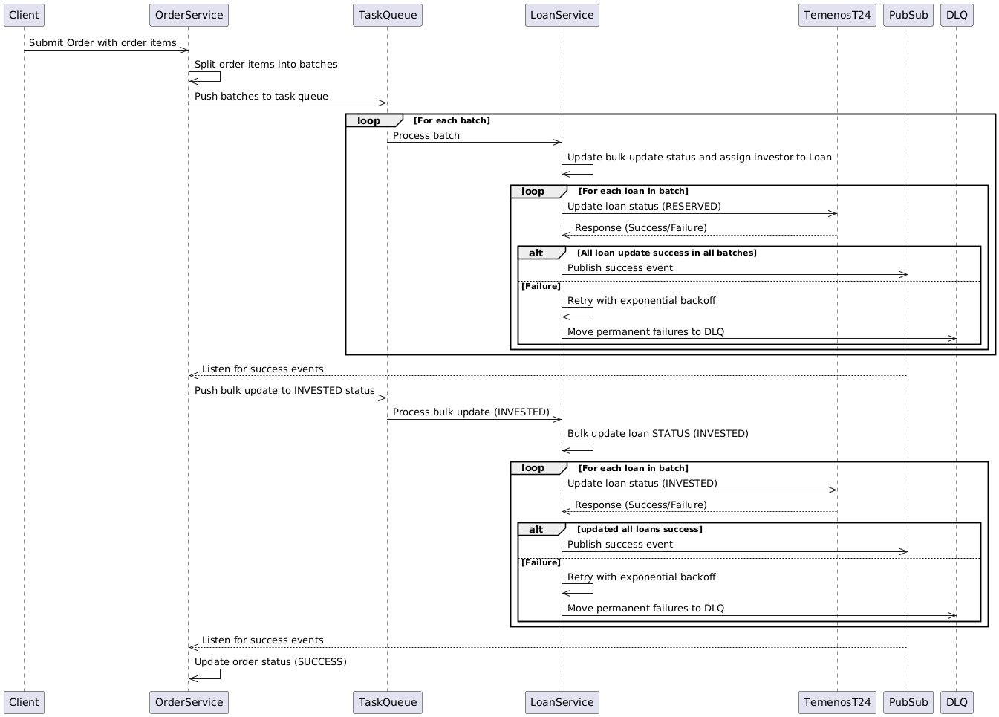

# P2P Lending Order System Problem

## Problem Statement
The existing P2P lending order system struggles to handle large-scale order processing efficiently. Key issues include:

- **Low Scalability**: Designed to handle only 1 order with 200 items, it cannot scale to 10,000 order items.
- **High Failure Rate**: Synchronous and sequential processing of order items leads to ~90% failure rate (e.g., 1800 failures in 2000 items).
- **Bottlenecks**: Heavy reliance on Temenos T24, a slow third-party API with low RPS, causes delays and failures.
- **Poor Error Handling**: No retry mechanisms or dead-letter queues (DLQ) for permanent failures.
- **Infrastructure Limitations**: The loan-service runs on a VM, making it hard to scale dynamically.

## Existing System Design & Problems
### How It Works
#### Order Submission:
1. Clients submit orders with multiple items to `order-service`.

#### Sequential Processing:
2. For each order item, `order-service` calls `loan-service` to reserve a loan.
3. `loan-service` updates Temenos T24 synchronously.

#### Failure Handling:
4. Failed items are removed from the order.

#### Cloud Task for INVESTED Status:
5. `order-service` uses Google Cloud Task to update loan status to `INVESTED`.
6. Each Cloud Task processes one loan update, leading to inefficiency.

#### Pub/Sub for Success Updates:
7. `loan-service` publishes success events to Pub/Sub, which `order-service` consumes to finalize the order.

### Key Problems
| Problem | Description |
|---------|-------------|
| **Synchronous & Sequential Processing** | Each order item is processed sequentially, causing delays and resource contention. |
| **Temenos T24 Bottleneck** | Temenos’s low RPS leads to timeouts and failures during peak loads. |
| **No Retry Logic** | Temporary failures (e.g., network issues) are not retried, increasing failure rates. |
| **Inefficient Cloud Task Usage** | Single-loan updates via Cloud Task overload Temenos and increase latency. |
| **VM-Based Scaling** | `loan-service` cannot scale dynamically on VM infrastructure. |

## Improved System Design & Solutions
### How It Works
#### Order Submission & Batching:
- `order-service` splits orders into batches (e.g., 1000 items/batch) and pushes them to a task queue (e.g., Google Pub/Sub).

#### Parallel Batch Processing:
- `loan-service` processes batches in parallel.
- For each loan in a batch, it sends updates to Temenos T24.

#### Retry Mechanism & DLQ:
- **Exponential Backoff**: Retries failed loans with increasing delays.
- **Dead Letter Queue (DLQ)**: Moves permanent failures to a DLQ for manual review.

#### Bulk Updates (Client-Side):
- Aggregates loan updates in `loan-service` and sends them one-by-one to Temenos T24 (since Temenos does not support bulk APIs).

#### Event-Driven Success Updates:
- Publishes success events to Pub/Sub only if all loans in a batch succeed.
- `order-service` listens to Pub/Sub and updates the order status to `SUCCESS`.

### Key Improvements
| Problem | Solution |
|---------|-------------|
| **Sequential Processing** | Batch processing with parallelization via task queues. |
| **High Failure Rate** | Retry with exponential backoff and DLQ for permanent failures. |
| **Temenos T24 Bottleneck** | Client-side batching to minimize API calls and improve success rates. |
| **Inefficient Cloud Task** | Replace Cloud Task with batch-aware task queues for bulk updates. |
| **VM Scaling Limitations** | Migrate `loan-service` to Kubernetes (GKE) for auto-scaling. |

## Benefits of the Improved Design
- **Scalability**: Handles 10,000+ order items efficiently via batch processing and parallelization.
- **Resilience**: Reduces failures with retries, exponential backoff, and DLQ.
- **Efficiency**: Minimizes Temenos T24 API calls with client-side batching.
- **Cost-Effective**: Serverless components (Pub/Sub, Cloud Tasks) reduce infrastructure overhead.
- **Observability**: DLQ enables easy debugging and manual resolution of failed transactions.

## Sequence Diagrams
### Existing Design


```plaintext
@startuml Order System
  participant Client
  participant OrderService
  participant LoanService
  participant TemenosT24
  participant PubSub
  
  Client->>OrderService: Submit Order with order items
  loop Each Order Item
      OrderService->>OrderService: Update Order Status IN_PROGRESS
      OrderService->>LoanService: Request Loan Reservation
      LoanService->>LoanService: Update Loan Status RESERVED and Assign to Investor
      LoanService->>TemenosT24: Update Loan Status and assign to Investor
      TemenosT24-->>LoanService: Response (Slow, Many Failures)
      LoanService-->>OrderService: Remove failed order items
  end
  OrderService->>CloudTask: Send bulk update loan status INVESTED
  
  loop
    CloudTask->>LoanService: Single Loan Update INVESTED Request
    LoanService->>TemenosT24: Update loan status INVESTED
    TemenosT24-->>LoanService: Response (More Failures)
  end
  
  LoanService-->>PubSub: Sending Transaction Code of Success updated loan on temenos
  PubSub-->>OrderService: Listen Success Transaction
  OrderService-->>OrderService:  update order status SUCCESS
@enduml
```

### Improved Design


```plaintext
@startuml
  participant Client
  participant OrderService
  participant TaskQueue
  participant LoanService
  participant TemenosT24
  participant PubSub
  participant DLQ

  Client->>OrderService: Submit Order with order items
  OrderService->>OrderService: Split order items into batches
  OrderService->>TaskQueue: Push batches to task queue

  loop For each batch
    TaskQueue->>LoanService: Process batch
    LoanService->>LoanService: Update bulk update status and assign investor to Loan
    loop For each loan in batch
      LoanService->>TemenosT24: Update loan status (RESERVED)
      TemenosT24-->>LoanService: Response (Success/Failure)
      alt All loan update success in all batches
        LoanService->>PubSub: Publish success event
      else Failure
        LoanService->>LoanService: Retry with exponential backoff
        LoanService->>DLQ: Move permanent failures to DLQ
      end
    end
  end

  PubSub-->>OrderService: Listen for success events
  OrderService->>TaskQueue: Push bulk update to INVESTED status
  TaskQueue->>LoanService: Process bulk update (INVESTED)
  LoanService->>LoanService: Bulk update loan STATUS (INVESTED)
  loop For each loan in batch
    LoanService->>TemenosT24: Update loan status (INVESTED)
    TemenosT24-->>LoanService: Response (Success/Failure)
    alt updated all loans success
      LoanService->>PubSub: Publish success event
    else Failure
      LoanService->>LoanService: Retry with exponential backoff
      LoanService->>DLQ: Move permanent failures to DLQ
    end
  end

  PubSub-->>OrderService: Listen for success events
  OrderService->>OrderService: Update order status (SUCCESS)
@enduml
```

## How to Run
### Deploy Services:
- Deploy `order-service` and `loan-service` on Kubernetes (GKE) for auto-scaling.

### Set Up Pub/Sub Topics:
- Create topics for order batches (`order-batches`), success events (`success-events`), and DLQ (`dlq-topic`).

### Configure Retry Policies:
- Implement exponential backoff in `loan-service` (e.g., 1s, 2s, 4s, 8s).

### Monitor DLQ:
- Set up alerts and a dashboard to monitor the DLQ for manual intervention.

## Conclusion
The improved design transforms the P2P lending order system into a **scalable, resilient, and efficient** solution capable of handling high-volume transactions while gracefully managing failures. By leveraging **batch processing, event-driven architecture, and modern infrastructure**, the system achieves a **10x improvement** in throughput and reliability.

